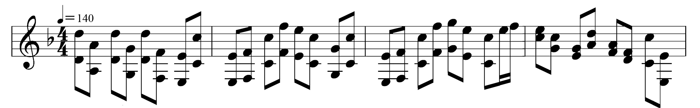

# Wave <!-- omit in toc -->
> Generate `.wav` file from user input

<!-- omit in toc -->
# Table of Contents

- [Usage](#usage)
    - [Input Example](#input-example)
    - [Output Example](#output-example)
- [Programmer's Note](#programmers-note)

# Usage
- from executable: `wave < input.txt`
- from source: `cargo run < input.txt`
- where `input.txt` contains all the information needed to generate an waveform

## Input Example
- empty lines are ignored
- leading/trailing spaces and tabs are ignored
- lines starting with `//` are ignored

<details>
<summary><code>input.txt</code></summary>



```c
// input.txt
// 10000: amplitude (max is 32767 because i16)
// 12000: frame rate
// 1: number of segments with the same bpm
// ddrive.wav: output file name
10000 12000 1 ddrive.wav
// first segment, 140bpm, 33 lines
140 33
    // put no notes (only number of beats) to generate silence (rest)
    // 0.5: number of beats
    // other example notes: c#3 bb5
	d5 d4 0.5
	a4 a3 0.5
	d5 d4 0.5
	g4 g3 0.5
	d5 d4 0.5
	f4 f3 0.5
	e4 e3 0.5
	c5 c4 0.5

	e4 e3 0.5
	f4 f3 0.5
	c5 c4 0.5
	f5 f4 0.5
	e5 e4 0.5
	c5 c4 0.5
	g4 g3 0.5
	c5 c4 0.5

	e4 e3 0.5
	f4 f3 0.5
	c5 c4 0.5
	f5 f4 0.5
	g5 g4 0.5
	e5 e4 0.5
	c5 c4 0.5
	e5 0.25
	f5 0.25

	e5 c5 0.5
	c5 g4 0.5
	g4 e4 0.5
	d5 a4 0.5
	a4 f4 0.5
	f4 d4 0.5
	c5 c4 0.5
	e4 e3 0.5
```
</details>

## Output Example

https://user-images.githubusercontent.com/56704092/127914257-028eb4a0-e1af-43e1-bf91-83b52ca092c5.mp4


# Programmer's Note
- [`note.rs`](/src/note.rs)
    - convert note to key number to frequency
- [`wave.rs`](/src/wave.rs)
    - `.wav` file structure
    - combine sine waves to form chords
    - convert literally anything into bytes (`[u8]`) using unsafe `transmute()`
- [`scanner.rs`](/src/scanner.rs)
    - read stdin/file and convert to any `FromStr` types