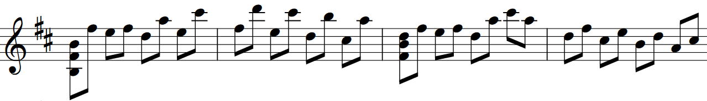

# Input Format
Each line of the input file must be any of the following (after being trimmed):

|           Description            | Regex Representation |     How the Program Will Interpret It     |       Example        |
| :------------------------------: | :------------------: | :---------------------------------------: | :------------------: |
|         empty/whitespace         |       `^\s*$`        |                  ignore                   |         `\t`         |
| starts with non-digit characters |        `^\D`         | ignore (treated as [comments](#comments)) | `==== anything ====` |
|    contains only one integer     |      `^(\d+)$`       |            set new BPM to `$1`            |        `200`         |
|               else               |                      |     see [Chords/Notes](#chordsnotes)      |    `4 c#4 2 c#2`     |


## Comments
> any line that doen't start with an ascii digit character

comments can be used for:

- seperators between 
    - [beamed notes](https://en.wikipedia.org/wiki/Beam_(music))
    - [bars/measures](https://en.wikipedia.org/wiki/Bar_(music))
    - [staves](https://en.wikipedia.org/wiki/Staff_(music))
    - pages
- indented folding

<details><summary>Example: use comments to separate bars and beams with indentation</summary>


```
==== BPM  =====
164
==== Bar 1 ====
	8 b2 f#4 b4
	8 f#5
	-----------
	8 e5
	8 f#5
	-----------
	8 d5
	8 a5
	-----------
	8 e5
	8 c#6
==== Bar 2 ====
	8 f#5
	8 d6
	-----------
	8 e5
	8 c#6
	-----------
	8 d5
	8 b5
	-----------
	8 c#5
	8 a5
==== Bar 3 ====
	8 f#4 b4 d5
	8 f#5
	-----------
	8 e5
	8 f#5
	-----------
	8 d5
	8 a5
	-----------
	8 c#6
	8 a5
==== Bar 4 ====
	8 d5
	8 f#5
	-----------
	8 c#5
	8 e5
	-----------
	8 b4
	8 d5
	-----------
	8 a4
	8 c#5
```
</details>

## BPM
> any line that only contains a single integer

the BPM line can be used for:

- changing the tempo in the middle of the piece

N.B. the first non-comment line must be a BPM line to set the initial tempo

<!-- <details><summary></summary><details> -->

## Chords/Notes
> any line that contains at least 2 non-whitespace characters separated by whitespace and starts with an integer

formally, the syntax is defined as:
```
{chord|note} [{chord|note} ...]
```
where:

- `<chord>: <value> <pitch> [<pitch> ...]`
- `<note>: <value> <pitch>`
- `<value>:`  [value](https://en.wikipedia.org/wiki/Note_value) of a note, which can be any of the following:
    - `[0-9]+` for nth note (e.g. `4` for a [quarter/crotchet](https://en.wikipedia.org/wiki/Quarter_note) note)
    - `[0-9]+\*` for [dotted](https://en.wikipedia.org/wiki/Dotted_note) note (e.g. `2*` for a dotted [half/minim](https://en.wikipedia.org/wiki/Half_note) note)
    - `[0-9]-` for [legato](https://en.wikipedia.org/wiki/Legato)/[tie](https://en.wikipedia.org/wiki/Tie_(music)) (e.g. `8-` for an [eighth/quaver](https://en.wikipedia.org/wiki/Eighth_note) note that does not end with silence)
    - `[0-9]*-` for dotted legato/tie (e.g. `16*-`)
- `<pitch>:` the pitch of the note in [scientific notation](https://en.wikipedia.org/wiki/Scientific_pitch_notation) (but in lowercase)
    - `[a-g][0-9]` for a [natural](https://en.wikipedia.org/wiki/Natural_(music)) (e.g. `a4` for [A440](https://en.wikipedia.org/wiki/A440_(pitch_standard)), `c5` for [Tenor C](https://en.wikipedia.org/wiki/Tenor_C))
    - `[a-g]b[0-9]` for a [flat](https://en.wikipedia.org/wiki/Flat_(music)) note (e.g. `bb2` for B♭<sub>2</sub>)
    - `[a-g]#[0-9]` for a [sharp](https://en.wikipedia.org/wiki/Sharp_(music)) note (e.g. `f#3` for F♯<sub>3</sub>)
    - `[^a-z\s]\S*` for a [rest](https://en.wikipedia.org/wiki/Rest_(music)) (e.g. `.` `\` `-` )