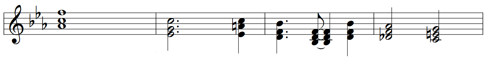
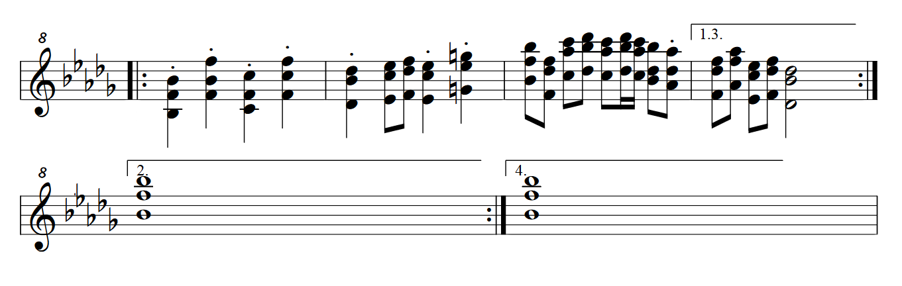

# Input Format

## Comments
> any line that doen't start with an ascii digit character

comments can be used for:

- seperators between 
    - [beamed notes](https://en.wikipedia.org/wiki/Beam_(music))
    - [bars/measures](https://en.wikipedia.org/wiki/Bar_(music))
    - [staves](https://en.wikipedia.org/wiki/Staff_(music))
    - pages
- indented folding

<details><summary>Example: use comments to separate bars and beams with indentation</summary>


```
==== BPM  =====
164
==== Bar 1 ====
    8 b2 f#4 b4
    8 f#5
    -----------
    8 e5
    8 f#5
    -----------
    8 d5
    8 a5
    -----------
    8 e5
    8 c#6
==== Bar 2 ====
    8 f#5
    8 d6
    -----------
    8 e5
    8 c#6
    -----------
    8 d5
    8 b5
    -----------
    8 c#5
    8 a5
==== Bar 3 ====
    8 f#4 b4 d5
    8 f#5
    -----------
    8 e5
    8 f#5
    -----------
    8 d5
    8 a5
    -----------
    8 c#6
    8 a5
==== Bar 4 ====
    8 d5
    8 f#5
    -----------
    8 c#5
    8 e5
    -----------
    8 b4
    8 d5
    -----------
    8 a4
    8 c#5
```
</details>

## BPM
> any line that only contains a single integer

the BPM line can be used for:

- changing the tempo in the middle of the piece

N.B. the first non-comment line must be a BPM line to set the initial tempo

## Chords/Notes
> any line that contains at least 2 non-whitespace characters separated by whitespace and starts with an integer

formally, the syntax is defined as:
```
{chord|note} [{chord|note} ...]
```
where:

- `<chord>: <value> <pitch> [<pitch> ...]`
- `<note>: <value> <pitch>`
- `<value>:`  [value](https://en.wikipedia.org/wiki/Note_value) of a note, which can be any of the following:
    - `[0-9]+` for nth note (e.g. `4` for a [quarter/crotchet](https://en.wikipedia.org/wiki/Quarter_note) note)
    - `[0-9]+\.` for [dotted](https://en.wikipedia.org/wiki/Dotted_note) note (e.g. `2.` for a dotted [half/minim](https://en.wikipedia.org/wiki/Half_note) note)
    - `[0-9]+\*` for [staccato](https://en.wikipedia.org/wiki/Staccato) (e.g. `8*` for a quarter/crotchet staccato)
    - `[0-9]\+[0-9]` for [tie](https://en.wikipedia.org/wiki/Tie_(music)) (e.g. `8+8` for a quarter/crotchet note)
- `<pitch>:` the pitch of the note in [scientific notation](https://en.wikipedia.org/wiki/Scientific_pitch_notation) (but in lowercase)
    - `[a-g][0-9]` for a [natural](https://en.wikipedia.org/wiki/Natural_(music)) (e.g. `a4` for [A440](https://en.wikipedia.org/wiki/A440_(pitch_standard)), `c5` for [Tenor C](https://en.wikipedia.org/wiki/Tenor_C))
    - `[a-g]b[0-9]` for a [flat](https://en.wikipedia.org/wiki/Flat_(music)) note (e.g. `bb2` for B♭<sub>2</sub>)
    - `[a-g]#[0-9]` for a [sharp](https://en.wikipedia.org/wiki/Sharp_(music)) note (e.g. `f#3` for F♯<sub>3</sub>)
    - `[^a-z0-9\s]` for a [rest](https://en.wikipedia.org/wiki/Rest_(music)) (e.g. `.` `\` `-` )

# Input Examples

<details><summary>Example: rests and ties</summary>


```
== BPM  ==
164
== bass ==     == treble ==
4 c#2 c#3      2 c#4 c#5
4 \
8 c#2 c#3      2+4 g#3 g#4
8 c#2 c#3
4 \

4 c#2 c#3
4 c#2 c#3      4 c#4
8 c#2 c#3      4 d#4
8 c#2 c#3
4                e4

4 c#2 c#3      2 f#4 1+4 a4
4 \
8 c#2 c#3      2+4 c#4
8 c#2 c#3
4 \

4 c#2 c#3
4 c#2 c#3      4 f#4
8 c#2 c#3      4 g#4
8 c#2 c#3
4                b4
```
</details>

<details><summary>Example: dotted notes and ties</summary>


```
==== BPM ====
175

1   ab4 c5 f5

2.  eb4 g4 c5
4   eb4 a4 c5

4.  d4 f4 bb4
8+4 bb3 d4 f4
4   d4 f4 bb4

2   db4 f4 ab4
2   c4 e4 g4
```
</details>

<details><summary>Example: repeats and staccatos</summary>


```
======= BPM ========
151
====================
|:
    4* bb3 eb4 bb4
    4* f4 bb4 f5
    4* c4 eb4 c5
    4* f4 c5 f5
    ----------------
    4* db4 bb4 db5
    8 eb4 c5 eb5
    8 f4 db5 f5
    4* eb4 c5 eb5
    4* g4 eb5 g5
    ----------------
    8 bb4 f5 bb5
    8 f4 db5 f5
    8 c5 ab5 c6
    8 db5 bb5 db6
    8 c5 ab5 c6
    16 db5 bb5 db6
    16 c5 ab5 c6
    8 bb4 db5 bb5
    8* ab4 db5 ab5
|1.3.
    8 f4 db5 f5
    8 ab4 f5 ab5
    8 eb4 c5 eb5
    8 f4 db5 f5
    2 db4 bb4 db5
:| |2.
    1 bb4 f5 bb5
:| |4.
    1 bb4 f5 bb5
|
```
</details>


<!-- <details><summary></summary></details> -->
