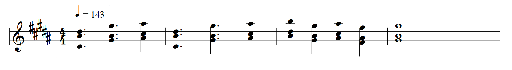
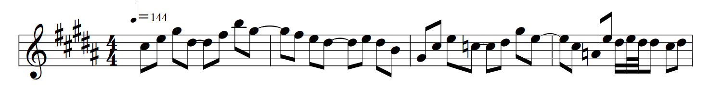
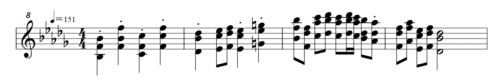

# Note Token
> let's see how many ASCII characters I can adopt for each possible dynamic/articulation/ornament/note value and note relationship

- reference: [parsers/notes.rs](../src/parsers/note.rs)

## Frequency Token
> uses HashMap to get the frequency at constant time and doesn't stores each frequency in cache

- uses [scientific pitch notation](https://en.wikipedia.org/wiki/Scientific_pitch_notation) but in lowercase

### Examples
- `c5`: Tenor C
- `a4`: A440
- `eb5`: E♭5
- `f#4`: F♯4

## Length Token
> I hate staccato because its duration is not the same as the size that it occupies

- a length token starts with `[0-9]+`, identifying it's note value
  - e.g. `4` is a 4th note, `16` is a 16th note 
- then it's followed by gibberish that I try to do my best to simplify as much as possible

### Dotted Note
> 1.5x duration and size


<details><summary>input</summary>

```
====== BPM =======
    143
==================
    4. d#4 b4 d#5
    4. g#4 b4 g#5
    4  a#4 c#5 a#5

    4. d#4 b4 d#5
    4. g#4 b4 g#5
    4  a#4 c#5 a#5

    4  b4 d#5 b5
    4  g#4 b4 g#5
    4  a#4 c#5 a#5
    4  f#4 a#4 f#5

    1  g#4 b4 g#5
```
</details>

### Tie
> connect multiple durations OF THE SAME FREQUENCY


<details><summary>input</summary>

```
==== BPM ====
    144
=============
    8 c#5
    8 e5
    8 g#5
    8+8 d#5
    8 f#5
    8 b5
    8+8 g#5

    8 f#5
    8 e5
    8+8 d#5
    8 e5
    8 d#5
    8 b4

    8 g#4
    8 c#5
    8 e5
    8+8 c5
    8 d#5
    8 g#5
    8+8 e5

    8 c#5
    8 a4
    8 e5
    16 d#5
    32 e5
    32 d#5
    16 d#5
    8 c#5
    8 d#5
```
</details>


### Staccato
> half length but keeps the size that it occupies


<details><summary>input</summary>

```
==== BPM ====
    151
=============
    4* bb3 eb4 bb4
    4* f4 bb4 f5
    4* c4 eb4 c5
    4* f4 c5 f5

    4* db4 bb4 db5
    8 eb4 c5 eb5
    8 f4 db5 f5
    4* eb4 c5 eb5
    4* g4 eb5 g5

    8 bb4 f5 bb5
    8 f4 db5 f5
    8 c5 ab5 c6
    8 db5 bb5 db6
    8 c5 ab5 c6
    16 db5 bb5 db6
    16 c5 ab5 c6
    8 bb4 db5 bb5
    8* ab4 db5 ab5

    8 f4 db5 f5
    8 ab4 f5 ab5
    8 eb4 c5 eb5
    8 f4 db5 f5
    2 db4 bb4 db5
```
</details>

